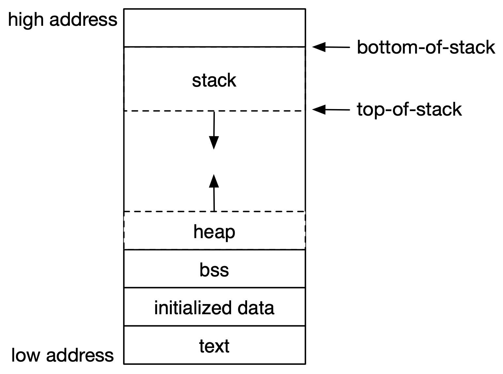

# Finding reachable memory

The hallmark of a conservative garbage collector is that it does not collect
any memory unless it determines that it is no longer *reachable*. In order for
any allocation to be reachable, there needs to be a pointer in the working
memory of the program that points to said allocation. The working memory is the
BSS (we ignore that on purpose), the CPU registers (we dump those on the stack
before scanning), the stack and all existing (`gc`-managed) allocations on the
heap.

Scanning means that we test each of these memory locations for a pointer to another
memory location, determining the transitive closure of allocated memory.
Everything that is not in the transitive closure is then collected.

Note that there are many ways how each of these steps can be optimized but
most of these
optimizations are platfrom/compiler-dependent and therefore out of the scope of
`gc` (at least currently).

## Memory layout of a C program

In order to understand the scanning process, it is necessary to understand the
standard memory layout of a C program:



The key observations for our discussion are

1. The stack grows towards *smaller* memory addresses. This is the case for
   all mainstream platforms, either by convention or by requirement.
2. The heap grows upwards


There are platforms on which the stack grows towards larger memory addresses
but we're safe to ignore those for the scope of `gc`.

## Scanning the stack

Scanning the stack starts by determining the stack boundaries. The
*bottom-of-stack* pointer, named `bos` refers to the *address of the
lowest stack frame on the stack* (i.e. the highest address in memory). The
*top-of-stack* pointer referes to the highest stack frame on the stack, i.e.
the *lowest* address on the stack.
In other words, we expect `tos` < `bos`.

```c
void gc_mark_stack(GarbageCollector* gc)
{
    char dummy;
    void *tos = (void*) &dummy;
    void *bos = gc->bos;
    for (char* p = (char*) tos; p < (char*) bos; ++p) {
        gc_mark_alloc(gc, *(void**)p);
    }
}
```

The code here is straightforward:

1. Declare a local variable `dummy` on the stack such that we can use
   its address as top-of -stack, ie. `tos = &dummy`.
2. Get the bottom-of-stack from the `gc` instance.
3. Iterate over all memory locations between `tos` and `bos` and check
   if they contain references to known memory locations (`gc_mark_alloc()`
   queries the allocation map and recursively marks the allocations if the
   pointed-to memory allocations are a known key in the allocation map).

That leaves two questions: why are we iterating using a `char*` and 
what does `*(void**)p` do?

### Stack alignment and `char*`

The reason why we are using a `char*` to iterate over the stack is because it
allows us to access each byte on the stack. This is simply an (inefficient) 
approach to
not having to deal with stack alignment across different platforms and/or
compilers.

An obvious optimization would be to assume proper stack alignment of pointers
and, starting from `tos`, work out way forward in 4- (for 32 bit systems) or
8-byte (for 64 bit systems) steps instead of the 1-byte steps afforded by
`char*`.

### Deciphering `*(void**)p`

It's just confusing to read, and we can make it easier by introducing a
`typedef`. Let's define a pointer to a memory location like so:

```c
typedef void* MemPtr
```

We can then rewrite `*(void**)p` as

```c
`*(MemPtr*)p`
```

making the syntax much less confusing. In detail, `p` is of type `char*`, so
`(MemPtr*)p` is just a cast of the `char` pointer to be a pointer to a `MemPtr`
type. The leftmost asterisk then dereferences to the content of the memory
address pointed to by the `MemPtr*`, which is the content we want to check for
references (i.e. pointers) to known memory locations.

## Scanning the heap

Compared to scanning the stack, scanning the heap is trivial: we just iterate
over all known allocations and check if they contain a pointer to another
(known) allocation:

```c
void gc_mark_roots(GarbageCollector* gc)
{
    for (size_t i = 0; i < gc->allocs->capacity; ++i) {
        Allocation* chunk = gc->allocs->allocs[i];
        while (chunk) {
            if (chunk->tag & GC_TAG_ROOT) {
                gc_mark_alloc(gc, chunk->ptr);
            }
            chunk = chunk->next;
        }
    }
}
```

## Implementing `gc_mark_alloc()`

Taking a closer look at `gc_mark_alloc()` reveals that it is really only a loop
that iterates over the memory content of an allocation, attempting to find any
pointers located within:

```c
void gc_mark_alloc(GarbageCollector* gc, void* ptr)
{
    Allocation* alloc = gc_allocation_map_get(gc->allocs, ptr);
    if (alloc && !(alloc->tag & GC_TAG_MARK)) {
        alloc->tag |= GC_TAG_MARK;
        for (char* p = (char*) alloc->ptr;
                p < (char*) alloc->ptr + alloc->size;
                ++p) {
            gc_mark_alloc(gc, *(void**)p);
        }
    }
}

